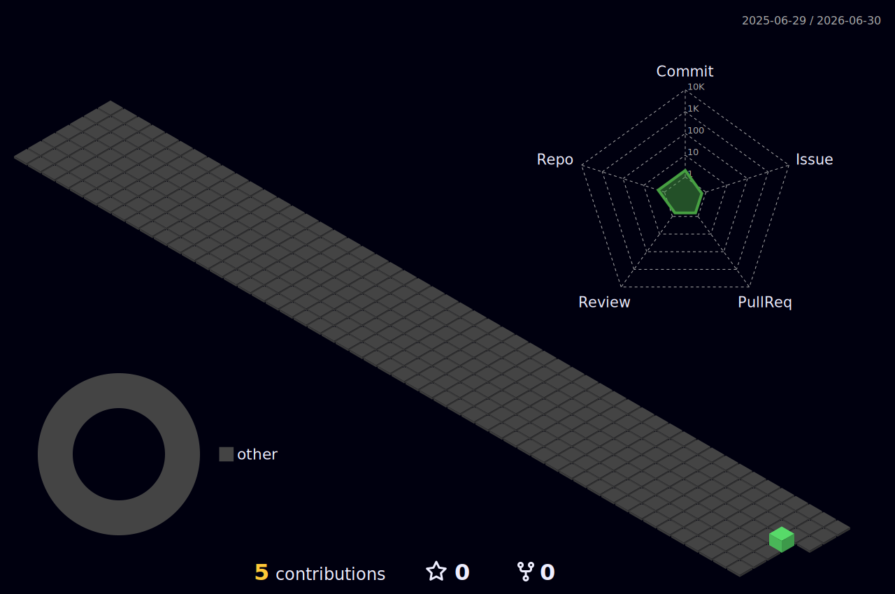

<div align="center">

<!-- Header -->


<!-- Typing intro -->
<a href="https://git.io/typing-svg">
  
</a>

<br/>

[](https://github.com/hyuphaqu)
[](https://github.com/hyuphaqu)

</div>

---

## About Me

```python
class Haqu:
    def __init__(self):
        self.name = "hyuphaqu"
        self.role = "Full Stack Developer"
        self.languages = ["Python", "JavaScript", "TypeScript", "Java"]
        self.frameworks = ["Django", "React", "Next.js", "Flutter"]
        self.databases = ["PostgreSQL", "MySQL", "Redis"]
        self.tools = ["Docker", "Git", "GitHub", "VS Code", "Linux"]
        self.current_focus = "AI & Web Development"

    def say_hi(self):
        print("좋은 코드를 고민하고, 꾸준히 만드는 개발자입니다.")


me = Haqu()
me.say_hi()
```

---

## Tech Stack

<div align="center">

### Main Technologies

<p>
  
</p>

### Also Working With

<p>
  
</p>

### Tools & Infrastructure

<p>
  
</p>

</div>

---

## GitHub Analytics

<div align="center">
  
  
</div>

<br/>

<div align="center">
  
</div>

<br/>

<div align="center">
  
</div>

---

## 3D Contribution Map

<div align="center">
  
</div>

---

## Contribution Snake

<div align="center">
  <picture>
    <source media="(prefers-color-scheme: dark)" srcset="https://raw.githubusercontent.com/hyuphaqu/hyuphaqu/output/github-snake-dark.svg" />
    <source media="(prefers-color-scheme: light)" srcset="https://raw.githubusercontent.com/hyuphaqu/hyuphaqu/output/github-snake.svg" />
    
  </picture>
</div>

---

## GitHub Trophies

<div align="center">
  
</div>

---

<div align="center">


</div>
